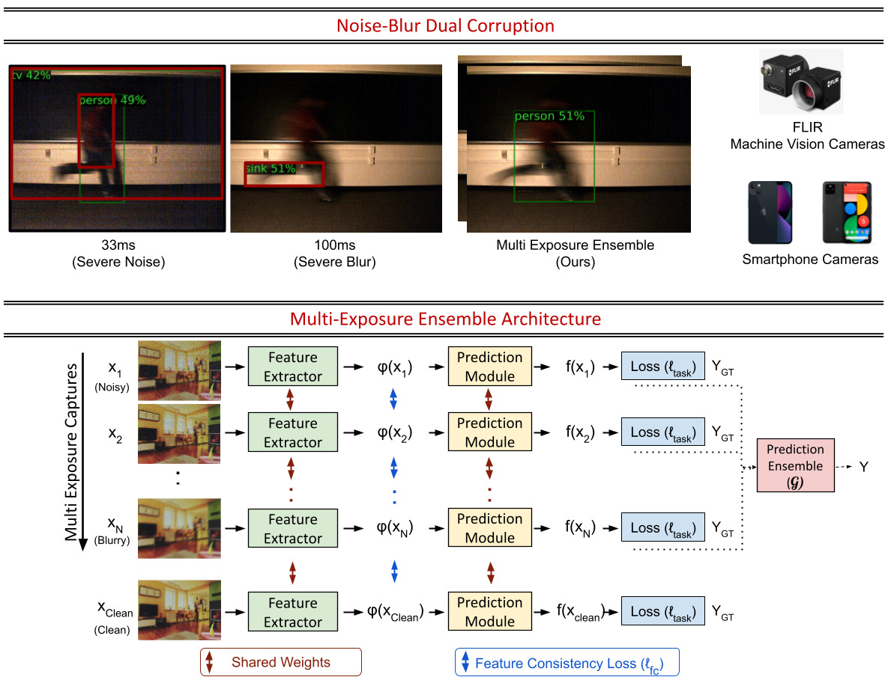

## Robust Scene Inference under Noise-Blur Dual Corruptions

**ICCP 2022** <br> [Arxiv](https://arxiv.org/abs/2207.11643) &nbsp; [Project](https://wisionlab.cs.wisc.edu/project/noiseblurdual/)



#### [Bhavya Goyal](https://bhavyagoyal.github.io), [Jean-François Lalonde](http://vision.gel.ulaval.ca/~jflalonde/), [Yin Li](https://www.biostat.wisc.edu/~yli/), [Mohit Gupta](https://wisionlab.cs.wisc.edu/people/mohit-gupta/)
University of Wisconsin-Madison, Université Laval


### Abstract

Scene inference under low-light is a challenging problem due to severe noise in the captured images. One way to reduce noise is to use longer exposure during the capture. However, in the presence of motion (scene or camera motion), longer exposures lead to motion blur, resulting in loss of image information. This creates a trade-off between these two kinds of image degradations: motion blur (due to long exposure) vs. noise (due to short exposure), also referred as a dual image corruption pair in this paper. With the rise of cameras capable of capturing multiple exposures of the same scene simultaneously, it is possible to overcome this trade-off.

Our key observation is that although the amount and nature of degradation varies for these different image captures, the semantic content remains the same across all images. To this end, we propose a method to leverage these multi exposure captures for robust inference under low-light and motion. Our method builds on a feature consistency loss to encourage similar results from these individual captures, and uses the ensemble of their final predictions for robust visual recognition. We demonstrate the effectiveness of our approach on simulated images as well as real captures with multiple exposures, and across the tasks of object detection and image classification.

### Demo


### Citation
```
@article{goyal2022robust,
  title={Robust Scene Inference under Noise-Blur Dual Corruptions},
  author={Goyal, Bhavya and Lalonde, Jean-Fran{\c{c}}ois and Li, Yin and Gupta, Mohit},
  journal={arXiv preprint arXiv:2207.11643},
  year={2022}
}
```
